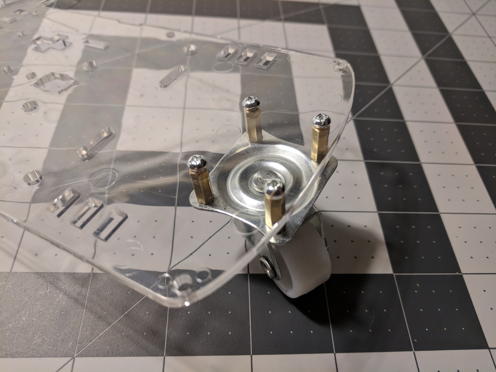

## Robotics Workshop

---

<!-- .slide: data-background-video="https://cdn.flixel.com/flixel/v26zyfd6yf0r33s46vpe.hd.mp4" data-background-video-loop="loop" data-background-video-muted -->

# WELCOME!

---

<!-- .slide: data-background-video="https://cdn.flixel.com/flixel/ts1p4x68ezcwbofpgaw2.hd.mp4" data-background-video-loop="loop" data-background-video-muted -->

## Expectations

  <ul>
  <li>Be respectful of your classmates and volunteers.
    <ul>
      <li>Do not talk over each other or the volunteers.</li>
      <li>Respect each others space.</li>
    </ul>
  <li>Help each other! Use each other as a resource.</li>
    <ul>
      <li>Teaching is learning.</li>
    </ul>
  <li>Mistakes are OK. Mistakes mean you're learning.</li>
  <li>Have fun!</li>
  </ul>

---

<!-- .slide: data-background-video="https://cdn.flixel.com/flixel/52vy4yxt8yw76d2u8dsm.hd.mp4" data-background-video-loop="loop" data-background-video-muted -->

# Volunteer Introductions

----

# CJ

* Your facilitator!
* Graduated from Louisiana Tech University
  * BA Computer Science, Minor in Mathematics
* Worked as a System Administrator, QA Analyst, Software Engineer
* Currently a Lead Instructor at Galvanize
* I like skateboarding and making music

---

<!-- .slide: data-background-video="https://cdn.flixel.com/flixel/14hemjzawc4tl7heatqw.hd.mp4" data-background-video-loop="loop" data-background-video-muted -->

# Agenda

----

# Day 1

* Ice Breaker
* What is a Robot?
* What is an Arduino?
* What is soldering?
* Solder Motors
* Assemble Robot

----

# Day 2

* What is code?
* Program Robot
* Customize/Decorate Robot
* (Stretch) Add sensor/LEDs
* Present at Showcase

---

<!-- .slide: data-background-video="https://cdn.flixel.com/flixel/krqazc6jzd3b2893tefg.tablet.mp4" data-background-video-loop="loop" data-background-video-muted -->

# ICE BREAKER

----

## ICE BREAKER

* Pair up!
* Take 4 minutes to introduce yourself to your pair
  * What's your name?
  * One thing about you (hobby, favorite food, favorite color etc.)
* We will go around and YOU will introduce your partner

---

<!-- .slide: data-background-video="https://cdn.flixel.com/flixel/mog3zyq4aro9e9g809ra.tablet.mp4" data-background-video-loop="loop" data-background-video-muted -->

# What is a Robot?

  <ul>
    <li>Define and Describe Robot</li>
    <li>List the many different types of Robots</li>
    <li>Explain why robots are useful</li>
  </ul>

----

## Define and Describe Robot

* Spend 2 minutes searching the web and reading about what is a robot.
* Write down in your own words "What is a robot?"

----

# Define and Describe Robot

----

## Define and Describe Robot

A Robot is a machine designed to accomplish a task.

* ATMs
* Vending Machines
* Washing Machines

----

## Define and Describe Robot

A machine capable of responding to its environment to automatically carry out complex or repetitive tasks with little, if any, direction from a human being.

* An Autonomous Car - a car that drives itself
* A Washing Machine that senses the clothing to adjust the cycle
* A thermostat that learns it's users preferences and automatically adjusts
* A roomba vacuum cleaner - learns and senses the floor layout to automatically clean the floor

----

## List the many different types of Robots

* Medical Robots
  * Designed to mimic a surgeons precise movements/actions
* Military Robots
  * Drones
  * Bomb defusers
  * Search through debris
* Automation/Manufacturing
  * Assembly line robotic arms
  * Automated Vacuum Cleaners
  * Autonomous Cars
  * Smart Dishwashers/Dryers/Washers

----

## Explain Why Robots are Useful

* Spend 2 minutes thinking about "Why are robots useful?".
* Write down in your own words "Why are robots useful?"

----

# Explain Why Robots are Useful

---

<!-- .slide: data-background-video="https://cdn.flixel.com/flixel/sjytbnalz6tpbgl9jqzn.hd.mp4" data-background-video-loop="loop" data-background-video-muted -->

# What is an Arduino?

  <ul>
    <li>Define and Describe MicroController</li>
    <li>Define and Describe an Arduino</li>
    <li>Identify an Arduino as a MicroController</li>
    <li>List the many uses of an Arduino</li>
  </ul>

----

## Define and Describe MicroController

* A single purpose computer
  * Similar to a desktop/laptop computer but only serves a single purpose
* Typically dedicated to a single task
  * Can only be programmed to do 1 thing at a time
* Contains:
  * CPU (Central Processing Unit)
  * Memory
  * Clock

----

## Define and Describe an Arduino

* A single purpose computer
* Has inputs and outputs
* Can be programmed to do many different things
  * Robots
  * Home Automation
  * Internet of Things
  * MUCH MORE!
* A rapid prototyping tool
  * An easy way to get started with electronics
    * In the past you had to source the materials and build something similar from scratch!
* Open Source hardware platform

----

## Identify an Arduino as a MicroController

An arduino is a MicroController! There are many other types of MicroControllers, but arduino is very popular one.

---

<!-- .slide: data-background-video="https://cdn.flixel.com/flixel/u08ojgwwslba0ghx53on.hd.mp4" data-background-video-loop="loop" data-background-video-muted -->

# What is soldering?

  <ul>
    <li>Define Soldering</li>
    <li>Describe why soldering is necessary</li>
    <li>List the ways to stay safe while soldering</li>
  </ul>

----

## Define Soldering

 A process in which two or more items (usually metal) are joined together by melting and putting a filler metal (solder) into the joint.

----

## Describe Why Soldering is Necessary

* Materials used in electronics require electricity to pass through them
* When working with electronics, we typically want to connect 2 components together
  * A wire and a motor!

----

## List the ways to stay safe while soldering

* Always wear safety glasses.
* Grip the soldering iron by the safety grip. NEVER touch the metal.
* Solder in a well-ventilated space
  * Do not inhale the fumes! Blow them away.
* Always put your soldering iron back in its stand when not in use
* Never, ever try to catch a hot soldering iron if you drop it. Let it fall, buy a new one if you have to — just don’t grab it!
* Give any soldered surface a minute or two to cool down before you touch it.
* Never leave flammable items (such as paper) near your soldering iron.

[How to Solder Safely](https://www.youtube.com/watch?v=3ht_JmfaCNM)

[Safe Soldering Checklist](http://www.dummies.com/education/science/safe-soldering-checklist/)

---

# ROBOT TIME!!!

---

<!-- .slide: data-background-video="https://cdn.flixel.com/flixel/h1pnkz1q4exz9wy0d70a.hd.mp4" data-background-video-loop="loop" data-background-video-muted -->

# Solder Motors

----

## Attach Wires

Create a hook/bend in the end of the wire with pliers

Hook the wire into the motor terminal

Squeeze wire closed with pliers to ensure a secure connection

----

## Solder Wires to Motors

* Place the soldering iron on the wire/terminal to heat it up
  * Don't hold for too long, the plastic will melt! (Avoid touching the plastic with the iron)
* Apply the solder
* Remove soldering iron and check that you have a secure connection

---

<!-- .slide: data-background-video="https://cdn.flixel.com/flixel/jjihphnwquisxx0xyxtg.phone.mp4" data-background-video-loop="loop" data-background-video-muted -->

# Assemble Robot

----

## Assemble Robot

1. Attach pivot wheel
2. Attach Motors
3. Attach battery pack
4. Attach Motor Controller to Arduino
5. Attach Arduino to robot
8. Connect battery wires
9. Connect motor wires

---

### Attach pivot wheel

---

### Attach Motors

---

### Attach Battery Pack

---

### Attach Motor Controller to Arduino

* Make sure it is lined up correctly
* Slowly press down! Do not bend the pins!

---

### Attach Arduino to Robot

* Make sure the USB port is facing outwards

---

### Connect Battery Wires

---

### Connect Motor Wires

---

<!-- .slide: data-background-video="https://cdn.flixel.com/flixel/1732iv96pd4mp6zx6xwa.hd.mp4" data-background-video-loop="loop" data-background-video-muted -->

# ROBOT COMPLETE!

---

<!-- .slide: data-background-video="https://cdn.flixel.com/flixel/167945eofe3pcg9z9y61.tablet.mp4" data-background-video-loop="loop" data-background-video-muted -->

# Day 2

* What is code?
* Program Robot
* Customize/Decorate Robot
* (Stretch) Add sensor/LEDs
* Present at Showcase
